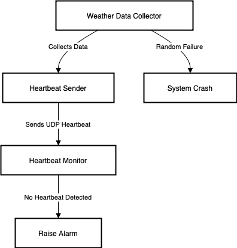
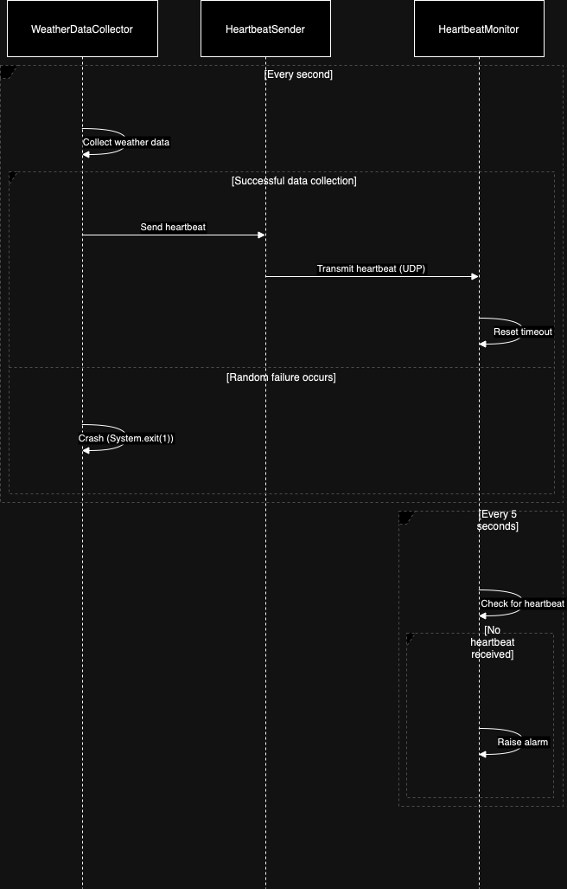

# SWEN755
**Course**: SWEN.755.01 - Software Architecture (SWEN75501.2241) **Instructor**: Viktoria Koscinski

## Project Overview
This project demonstrates a fault-tolerant **Weather Monitoring System** as part of the SWEN755 course. It highlights **fault detection** using a heartbeat mechanism and **fault recovery** via passive redundancy with checkpointing.

### System Components
The system consists of four primary components:

# Weather Monitoring System
This project is a part of the SWEN755 homework assignment. It simulates a weather monitoring system with fault detection using a heartbeat mechanism.

## Components
The system consists of three primary components:

### 1. WeatherDataCollector
- **File:** `WeatherDataCollector.java`
- **Functionality:** 
  - Simulates the collection of weather data (temperature and humidity) every second.
  - Includes a **5% chance of sensor failure**, which causes the component to crash.
  - Implements checkpointing every 5 data points to save state for recovery.
  - Sends heartbeat signals to confirm that the collector is functioning properly.

### 2. BackupWeatherDataCollector
- **File**: `BackupWeatherDataCollector.java`
- **Functionality**:
  - Stands by to take over data collection if the primary collector fails.
  - Loads the latest checkpoint to continue data collection from the point the primary collector left off.
  - Sends heartbeat signals to indicate its standby status.

### 3. HeartbeatSender
- **File:** `HeartbeatSender.java`
- **Functionality:** 
  - Sends "heartbeat" messages from both primary and backup collectors.
  - Includes the source of the heartbeat (PRIMARY or BACKUP) in the message.

### 4. HeartbeatMonitor
- **File:** `HeartbeatMonitor.java`
- **Functionality:** 
  - Listens for heartbeat signals from both collectors.
  - If no heartbeat is received from the primary collector within 5 seconds, it triggers a failover and activates the backup collector.

## Fault Tolerance Implementation
- **Fault Detection**: Heartbeat mechanism.
- **Fault Recovery**: Passive redundancy with checkpointing.
- **Redundancy Type**: Passive (standby backup).
- **Checkpointing**: Serialization of the weather collector state every 5 data points.
- **Failover Process**: The backup collector is automatically activated if the primary collector fails.


## Design Decisions
- **Non-deterministic failure**: The primary WeatherDataCollector has a 5% chance of failure per iteration.
- **UDP-based heartbeat messages**: For lightweight and efficient communication.
- **Timeout period**: A 5-second timeout is used for failure detection by the HeartbeatMonitor.
- **Checkpointing**: Serialization-based checkpointing ensures state preservation, allowing the backup to resume from the last saved state.
- **Distributed simulation**: Primary and backup collectors run as separate processes, simulating a distributed system.

## How to Run
1. Compile the Java files using a Java compiler.
   ```bash
   javac *.java
   ```
2. First, run the `HeartbeatMonitor` to start listening for heartbeats:
   ```bash
   java HeartbeatMonitor
   ```
3. Then, run the `WeatherDataCollector` which will start collecting data and sending heartbeats:
   ```bash
   java WeatherDataCollector
   ```
4. In another terminal, start the `BackupWeatherDataCollector`:
    ```bash
    java BackupWeatherDataCollector
    ```
The system will output collected weather data to the console, and the heartbeat monitor will notify you if the primary collector crashes and will automatically activate the backup.

## Diagrams
 ### System Architecture Diagram:
  

 ### Sequence Diagram:
  

---

## Frameworks and Libraries
- **Java Standard Edition (Java SE)**: Core libraries for random number generation, network communication (UDP), and exception handling.

## GitHub Repository

- **Repository URL**: [SWEN755 on GitHub](https://github.com/ms3660/SWEN755)
- **Clone via HTTPS**: 
    ```bash
    git clone https://github.com/ms3660/SWEN755.git
    ```