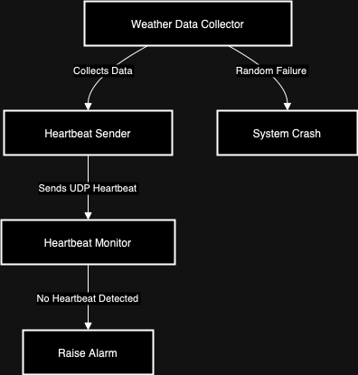

# SWEN755
Course: SWEN.755.01 - Software Architecture (SWEN75501.2241) Instructor: Viktoria Koscinski

# Assignment 1: Heartbeat Implementation

# Weather Monitoring System
This project is a part of the SWEN755 homework assignment. It simulates a weather monitoring system with fault detection using a heartbeat mechanism.

## Components
The system consists of three primary components:

### 1. WeatherDataCollector
- **File:** `WeatherDataCollector.java`
- **Functionality:** This component simulates the collection of weather data (temperature and humidity). The data is collected every second, and there is a 5% chance that a simulated sensor failure will occur, crashing the component. 
- **Responsibilities:**
  - Collect weather data from sensors.
  - Send heartbeat signals using the `HeartbeatSender` to confirm that the collector is functioning properly.
  - Simulate occasional crashes due to sensor malfunction.

### 2. HeartbeatSender
- **File:** `HeartbeatSender.java`
- **Functionality:** The `HeartbeatSender` is responsible for sending a "heartbeat" message to the `HeartbeatMonitor` to indicate that the `WeatherDataCollector` is still operational.
- **Responsibilities:**
  - Send regular heartbeat messages to the monitor.
  - Handle exceptions if there are issues with sending the heartbeat.

### 3. HeartbeatMonitor
- **File:** `HeartbeatMonitor.java`
- **Functionality:** The `HeartbeatMonitor` listens for heartbeat signals from the `WeatherDataCollector`. If no heartbeat is received within a set timeout (5 seconds), the monitor triggers an alert that the collector may have crashed.
- **Responsibilities:**
  - Listen for heartbeat signals.
  - Trigger an alert if no heartbeat is received within the specified timeout.

## Design Decisions
The failure in WeatherDataCollector is non-deterministic, with a 5% chance of occurrence on each iteration.
Heartbeat messages are sent using UDP for simplicity and to demonstrate a lightweight protocol.
The HeartbeatMonitor uses a 5-second timeout to detect failures.

## How to Run
1. Compile the Java files using a Java compiler.
   ```bash
   javac WeatherDataCollector.java HeartbeatSender.java HeartbeatMonitor.java
   ```
2. First, run the `HeartbeatMonitor` to start listening for heartbeats:
   ```bash
   java HeartbeatMonitor
   ```
3. Then, run the `WeatherDataCollector` which will start collecting data and sending heartbeats:
   ```bash
   java WeatherDataCollector
   ```
The system will output collected weather data to the console, and the heartbeat monitor will notify you if the collector crashes.

## Diagrams
- **System Architecture Diagram**:
  

- **Sequence Diagram**:
  

---

This system is a basic example of monitoring and fault detection using heartbeat signals. Future enhancements could include:
- A retry mechanism for the `WeatherDataCollector` before it crashes.
- More detailed heartbeat messages including system status or timestamps.

## Frameworks and Libraries
- **Java Standard Edition (Java SE)**: Core libraries for random number generation, network communication (UDP), and exception handling.
